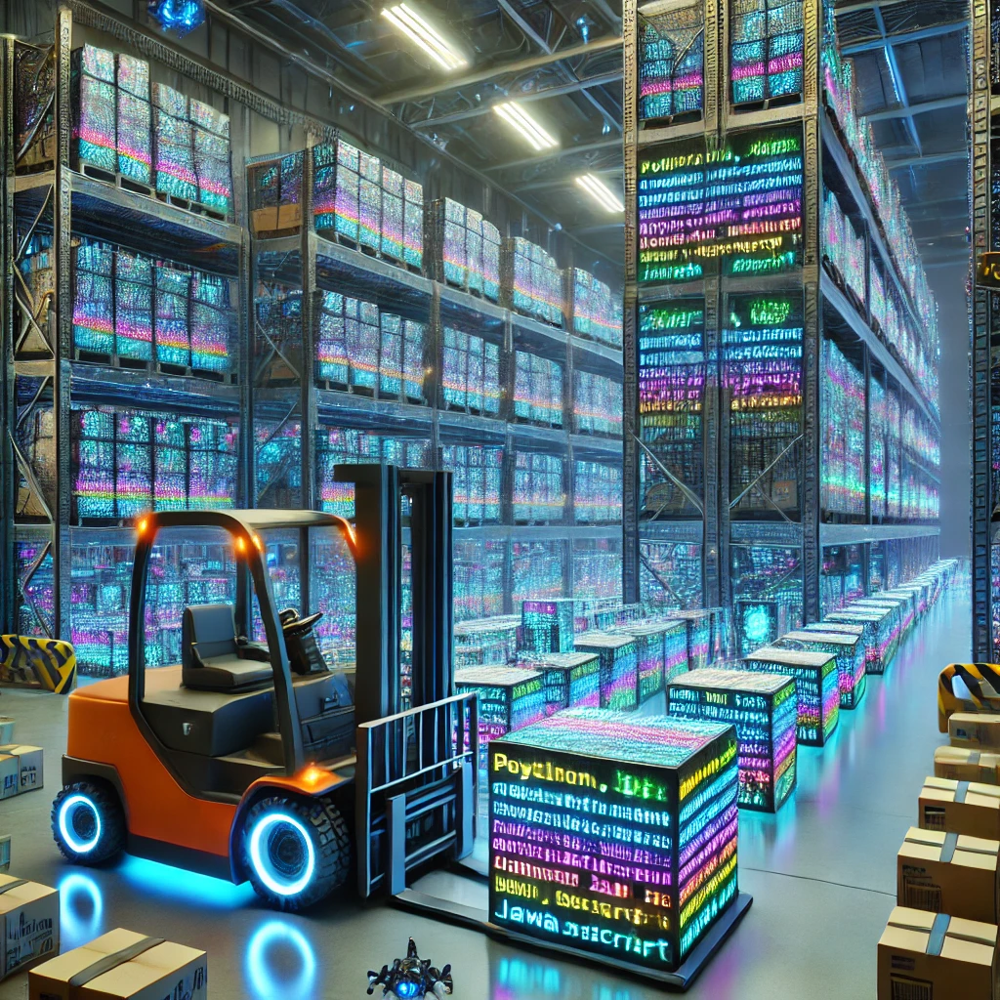

> 🚀 A visual, AI-ready warehouse for storing & reusing code like inventory.  
> 🧠 Built to be modular, collaborative, and addictively useful for devs.  
> 🔖 Tags: `#opensource` · `#snippets` · `#ai-ready` · `#modular-tools` · `#python`

  

# 🚀 next_gen_code_warehouse

A futuristic, open-source warehouse system for storing, retrieving, and managing code snippets and reusable components like inventory.

Imagine a forklift for functions. A barcode scanner for scripts. This is your digital stockroom for Python, JS, configs, and more.

---

## 💡 Why this project?

- Reuse, don't rewrite — save time and mental energy.
- Organize and retrieve code like warehouse goods.
- Build a searchable, extendable engine for your growing code base.

---

## 📦 Features

- 🧠 Categorized snippet storage by language, purpose, and tags
- 🔍 Searchable and filterable CLI interface
- 📁 File-backed storage and JSON indexing
- 🔄 Plans for web-based frontend & API

---

## 🛠️ Project Status

Still in early development — core storage and CLI features coming first.

---

## 📝 License

Licensed under the **GNU AGPL-3.0** to encourage open collaboration and prevent closed forks.  
See [`LICENSE`](./LICENSE) for full terms.
# next_gen_code_warehouse
